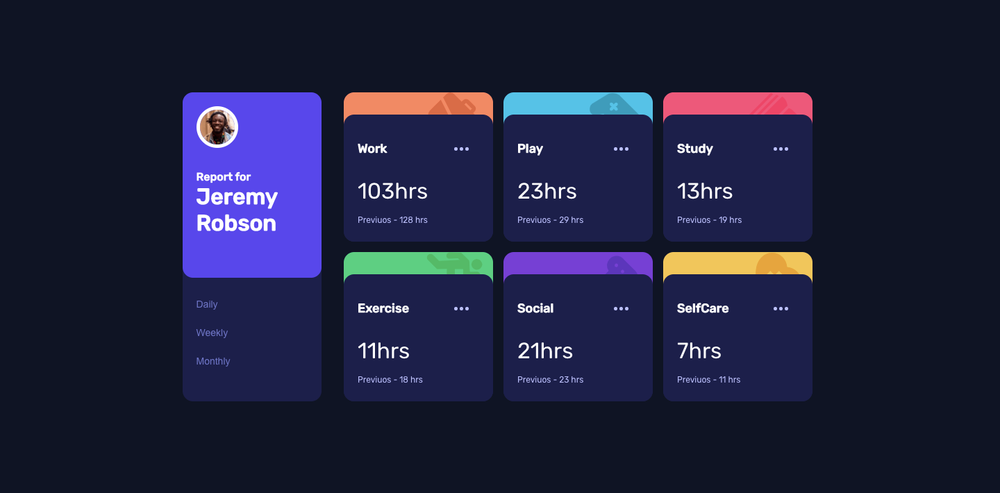

# Frontend Mentor - Time tracking dashboard solution

This is a solution to the [Time tracking dashboard challenge on Frontend Mentor](https://www.frontendmentor.io/challenges/time-tracking-dashboard-UIQ7167Jw). Frontend Mentor challenges help you improve your coding skills by building realistic projects.

## Table of contents

-    [Overview](#overview)
     -    [The challenge](#the-challenge)
     -    [Screenshot](#screenshot)
     -    [Links](#links)
-    [My process](#my-process)
     -    [Built with](#built-with)
     -    [What I learned](#what-i-learned)
     -    [Continued development](#continued-development)
-    [Author](#author)

## Overview

### The challenge

Your challenge is to build out this dashboard and get it looking as close to the design as possible.

You can use any tools you like to help you complete the challenge. So if you've got something you'd like to practice, feel free to give it a go.

If you would like to practice working with JSON data, we provide a local `data.json` file for the activities. This means you'll be able to pull the data from there instead of using the content in the `.html` file.

Users should be able to:

-    View the optimal layout for the site depending on their device's screen size
-    See hover states for all interactive elements on the page
-    Switch between viewing Daily, Weekly, and Monthly stats

### Screenshot

### Links

-    Solution URL: [Solution](https://github.com/esdra00/time-tracking-dashboard-react.git)
-    Live Site URL: [Live Site](https://esdra00.github.io/time-tracking-dashboard-react/)

## My process

### Built with

-    Semantic HTML5 markup
-    CSS custom properties
-    [React](https://reactjs.org/) - JS library
-    [Styled Components](https://styled-components.com/) - For styles

### What I learned

### Continued development

Implement graphs or scatter plots for data using Plotly.js, Chart.js, Google Chartor D3.js.
Having an hard time passing setState between components will come back to this when I have a solution.

## Author

-    Website - [Add your name here](https://www.your-site.com)
-    Frontend Mentor - [@esdra00](https://www.frontendmentor.io/profile/esdra00)
-    Github - [@esdra00](https://github.com/esdra00)
